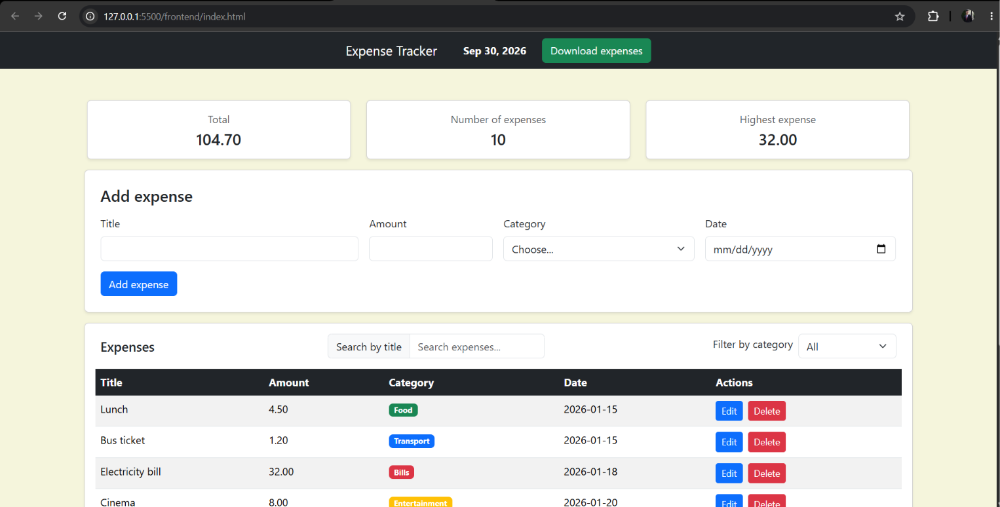
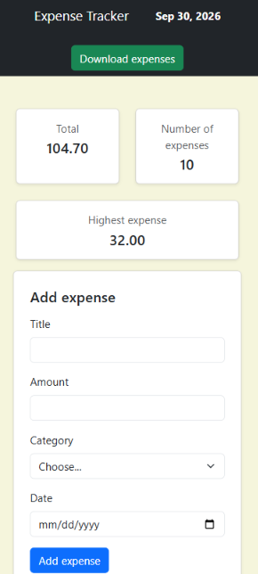
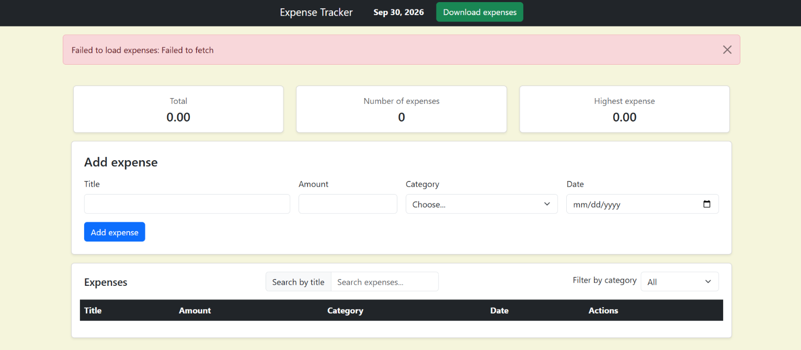
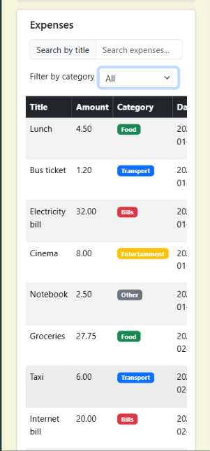
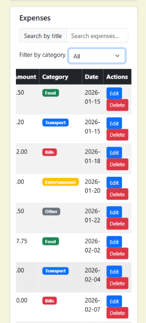

# Expense Tracker

A simple web app to track personal expenses. You can add, edit, delete, search by title, filter by category, export your expenses to CSV, and see a quick summary. Data is stored in a PostgreSQL database and served by an Express API.

## 🔗 GitHub Repository
 
[https://github.com/EmranAbdeen/Expense-Tracker]

## How to run

Requirements: Node.js, PostgreSQL, and VS Code.

**Backend**

1. Open a terminal in the project and go to the backend folder:

```bash
   cd backend
```

2. Install the dependencies:

```bash
   npm install
```

3. Create the database:

   Open **pgAdmin**
   `CREATE DATABASE expense_tracker;`

4. Create the table and add the sample data by running `schema.sql`:
   - Right-click the `expense_tracker` database → **Query Tool**.
   - Click the **Open File** icon and choose `backend/schema.sql` (or copy its content into the editor).
   - Click **Execute** (the button or press `F5`)

5. Create a file named `.env` inside the `backend` folder with your PostgreSQL settings:

```
   DB_HOST=localhost
   DB_PORT=5432
   DB_USER=postgres
   DB_PASSWORD=your_password_here
   DB_NAME=expense_tracker
```

6. Start the server (restart it after any change to `server.js`):

```bash
   node server.js
```

The API runs at `http://localhost:3000/api/expenses`.

**Frontend**

1. Keep the backend running.
2. Open `frontend/index.html` in the browser (in VS Code: right-click the file → _Open with Live Server_, ).

## API endpoints

| Method | Endpoint            | Description                             |
| ------ | ------------------- | --------------------------------------- |
| GET    | `/api/expenses`     | Get all expenses                        |
| GET    | `/api/expenses/:id` | Get one expense (404 if not found)      |
| POST   | `/api/expenses`     | Add an expense (201, or 400 if invalid) |
| PUT    | `/api/expenses/:id` | Update an expense (200, 400, or 404)    |
| DELETE | `/api/expenses/:id` | Delete an expense (200, or 404)         |

## Features

- [T] Add an expense (with validation)
- [T] Delete an expense
- [T] Edit an expense
- [T] Filter by category
- [T] Summary cards (total, count, highest)
- [T] Data is saved in a PostgreSQL database

## Screenshots

| Desktop                                        | Mobile                                              |
| ---------------------------------------------- | --------------------------------------------------- |
|   |          |
|  |  |
|                                                |  |

## Project Structure

```
project/
├── backend/
├── frontend/
├── docs/
│   └── ScreenshotAPI/
│   └── Screenshots/          # Images used in the README documentation
│       ├── desktop.png
│       ├── desktopE.png
│       └── mobile.png
│       └── mobileTableOne.png
│       └── mobileTableTwo.png
├── .gitignore
└── README.md
```

## What was the hardest part?

The hardest part was connecting the frontend to the backend.
PostgreSQL returns `NUMERIC` as text and `DATE` as a JavaScript Date, so amounts and dates looked wrong.
I fixed it in the SQL with `amount::float8` and `to_char(date, 'YYYY-MM-DD')`.
The row returned by `INSERT ... RETURNING *` had the same problem, so after every add, edit, or delete I call `refresh()` to rebuild the table from `GET /api/expenses`.
